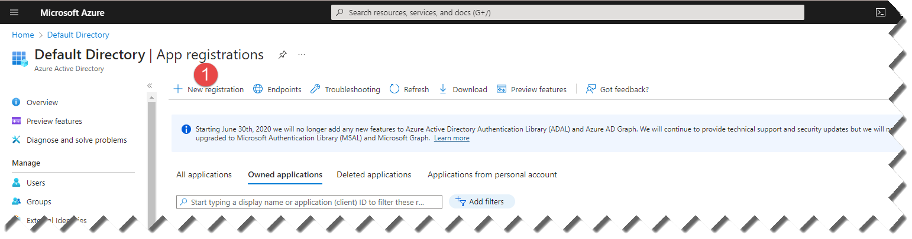

# Authentication
1. Go to the Azure portal (https://portal.azure.com/) and sign in with your Microsoft account or Azure Active Directory (AAD) account that has access to the Azure subscription you want to use.
2. In the left navigation pane, click on "App registrations".
3. Click the "New registration" button to create a new application registration.
4. Enter a name for your application registration in the "Name" field.
5. Under "Supported account types", select the option that matches your needs.
6. In the "Redirect URI" section, add a redirect URI that your application will use to receive authorization codes and access tokens. This URI must be a valid HTTPS endpoint that your application can receive requests on.
Click the "Register" button to create the application registration.
7. On the "Overview" page for your application registration, copy the "Application (client) ID" value to a secure location. This is your client ID.
8. Under "Certificates & secrets", click the "New client secret" button to create a new client secret.
9. Enter a name for your client secret in the "Description" field.
10. Select an expiration time for your client secret, or leave it as never expires.
11. Click the "Add" button to create the client secret.
12. Copy the client secret value to a secure location. This is your client secret.

