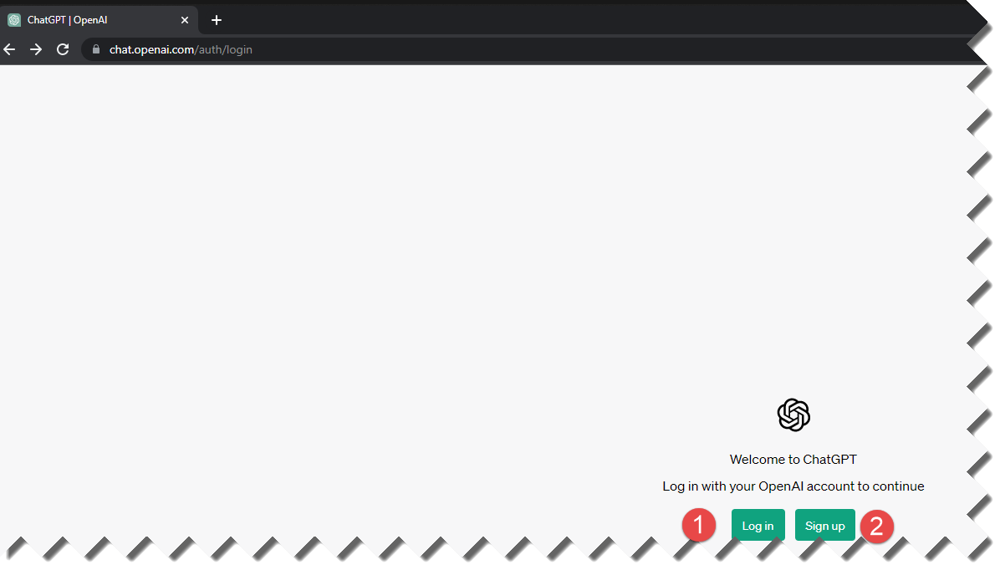

# Configure Account in Chat GTP
To create an account in ChatGPT, please follow these steps:

- Visit the OpenAI website: Go to the OpenAI website at https://www.openai.com/.

- Navigate to the GPT-3.5 Playground: Click on the "Playground" tab on the OpenAI website's navigation menu.

- Log in or sign up: If you already have an OpenAI account, log in using your credentials. If you don't have an account, click on the "Sign up" button and follow  the instructions to create a new account.

- Access the GPT-3.5 model: Once you're logged in, you'll be directed to the Playground. From the "Model" dropdown menu, select "gpt-3.5-turbo" as your preferred  model.

- Create an API key: To interact with the ChatGPT API, you need an API key. Click on your username at the top right corner of the Playground and select "API Keys" - from the dropdown menu.

- Generate a new API key: On the API Keys page, click on the "New Key" button. Give your API key a name (e.g., "ChatGPT Account"), and select the appropriate - permissions (e.g., "Chat: Read" and "Chat: Write"). Click on the "Create" button.

- Copy your API key: Once the API key is generated, copy it to your clipboard. It will be a long string of characters.

- Start using ChatGPT with your API key: Now you can use your API key to make requests to the ChatGPT API. You can integrate it into your applications or use it with tools like cURL or libraries in your preferred programming language.

Please note that creating an account and accessing the ChatGPT API may be subject to OpenAI's terms of use and any associated costs or limitations. Make sure to review the OpenAI documentation and guidelines for more detailed information on usage and pricing.

