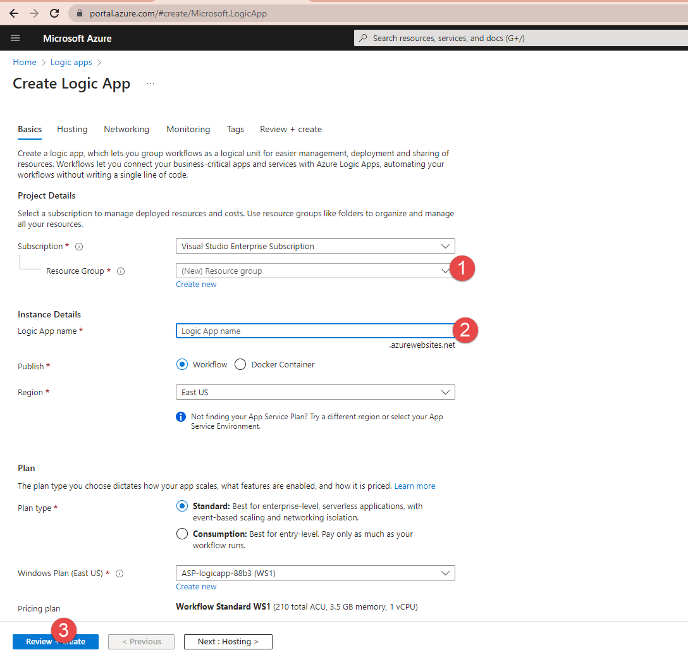
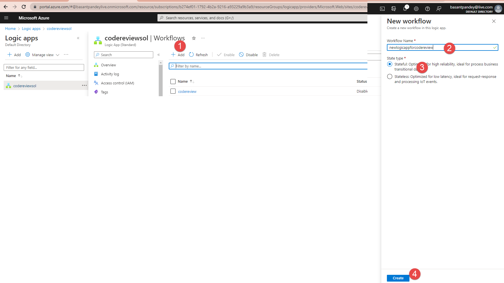
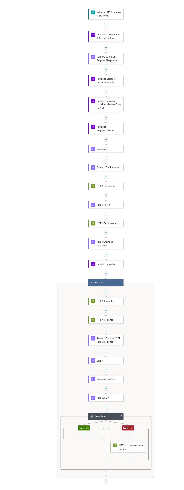

# Create logic App in azure steps
To create a Logic App in Azure, follow these steps:

- Sign in to the Azure portal: Go to https://portal.azure.com and sign in with your Azure account credentials.

- Navigate to Logic Apps: Once you're signed in, click on the "Create a resource" button (+) in the upper left corner of the Azure portal. In the search box, type - "Logic App" and select "Logic App" from the search results.



- Configure the Logic App basics:

    - Subscription: Choose the subscription under which you want to create the Logic App.
    - Resource group: Select an existing resource group or create a new one.
    - Name: Enter a unique name for your Logic App.
    - Region: Choose the region where you want to deploy the Logic App.
    - Workflow state location: Select the desired workflow state location.
    - Log Analytics: Optionally, enable or disable Log Analytics based on your requirements.
    - Click on the "Review + Create" button.
- Review and create the Logic App: On the review page, verify the configuration details for your Logic App. If everything looks correct, click on the "Create" - button.

- Access the Logic App designer: Once the deployment is complete, navigate to your Logic App resource by clicking on "Go to resource" or by searching for its name - in the Azure portal's search bar. You will be taken to the Logic App designer.

- Design your Logic App workflow: In the Logic App designer, you can start designing your Logic App workflow by adding triggers, actions, and conditions. The - designer provides a visual canvas to create and connect various workflow steps using a wide range of connectors and templates.

- Configure connectors and actions: Depending on your specific requirements, you can add connectors like Azure Storage, Azure Functions, Office 365, Salesforce, - etc., to your Logic App workflow. Configure the necessary actions and parameters for each connector to define the desired workflow behavior.



- Save and test your Logic App: As you build your Logic App workflow, make sure to save your progress periodically. You can also test your Logic App by triggering - the defined workflow manually or using sample data to ensure it functions as expected.

- Enable and monitor your Logic App: Once you are satisfied with your Logic App workflow, enable it to start executing automatically based on the defined triggers. - You can also monitor the execution history, track errors, and set up alerts for your Logic App using Azure Monitor or other monitoring tools.

List of operation

1. Request=> When a HTTP request is received
2. Data Operations => Parse JSON
3. Variables => Initializes a variable.
4. Variables => Initializes a variable.



1. Action : "When a HTTP request is received"
2. Action : "Data Operations = > Specify the schema of JSON content."
3. Action : Initializes a variable. 
    - variable name: lastMergeSourceCommitUrl
    - type : string
    - value : as mentioned below.
```json
concat(triggerBody()?['resource']?['lastMergeCommit']?['url'],'/changes')
```
4. Data Operations new :  Constructs an arbitrary object from the action's inputs. (compose)
    - inputs
```json
{
  "client_id": "xxxxxxx-xxxxx-4b79-a2b4-xxxx",
  "client_secret": ".xxxxx~K97ew1yfi7~xxxxx-nxqdu.",
  "grant_type": "client_credentials",
  "scope": "499b84ac-1321-427f-aa17-267ca6975798/.default"
}
```
5. Parse Json
    - content : `@outputs('Compose')`
    - payload schema
```json
{
    "properties": {
        "client_id": {
            "type": "string"
        },
        "client_secret": {
            "type": "string"
        },
        "grant_type": {
            "type": "string"
        },
        "scope": {
            "type": "string"
        }
    },
    "type": "object"
}
```
6. HTTP : Choose a REST API to invoke.
    - URI : `https://login.microsoftonline.com/tanantID/oauth2/v2.0/token`
    - Method: Post
    - Headers: 
```json
{
  "Content-Type" : "application/x-www-form-urlencoded"
}
```
- body
```json
uriComponentToString(concat('grant_type=', body('Parse_JSON_Request')?['grant_type'], '&scope=', body('Parse_JSON_Request')?['scope'], '&client_id=', body('Parse_JSON_Request')?['client_id'],'&client_secret=',body('Parse_JSON_Request')?['client_secret']))
```
7. Parse Json
    - Cotent: Body
    - Schema:
```json
{
    "properties": {
        "access_token": {
            "type": "string"
        },
        "expires_in": {
            "type": "integer"
        },
        "ext_expires_in": {
            "type": "integer"
        },
        "token_type": {
            "type": "string"
        }
    },
    "type": "object"
}
```
8.  HTTP : Choose a REST API to invoke.
    - URI : use variable *lastMergeSourceUrl*
    - Method: Get
    - Headers: 

```json
{
 "Accept": "@{concat('application','/json')}",
      "Authorization": "@{concat(body('Parse_Token')?['token_type'],' ',body('Parse_Token')?['access_token'])}",
      "Content-Type": "@{concat('application','/json')}"
}
```

9. Parse Json
    - content - body
    - schema
```json
{
    "properties": {
        "changeCounts": {
            "properties": {
                "Edit": {
                    "type": "integer"
                }
            },
            "type": "object"
        },
        "changes": {
            "items": {
                "properties": {
                    "changeType": {
                        "type": "string"
                    },
                    "item": {
                        "properties": {
                            "commitId": {
                                "type": "string"
                            },
                            "gitObjectType": {
                                "type": "string"
                            },
                            "objectId": {
                                "type": "string"
                            },
                            "originalObjectId": {
                                "type": "string"
                            },
                            "path": {
                                "type": "string"
                            },
                            "url": {
                                "type": "string"
                            }
                        },
                        "type": "object"
                    }
                },
                "required": [
                    "item",
                    "changeType"
                ],
                "type": "object"
            },
            "type": "array"
        }
    },
    "type": "object"
}
```
10. For each
    - Select output from previous step `@body('Parse_Changes_response')?['changes']`
    1. HTTP : Choose a REST API to invoke.
        - URI: `@items('For_each')?['item']['url']`
        - Method: Get
        - Headers:
```json
{
      "Authorization": "@{concat(body('Parse_Token')?['token_type'],' ',body('Parse_Token')?['access_token'])}",
      "Content-Type": "@{concat('application','/json')}"
    }
```
    
