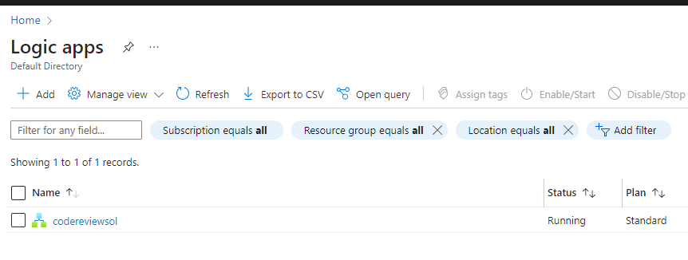
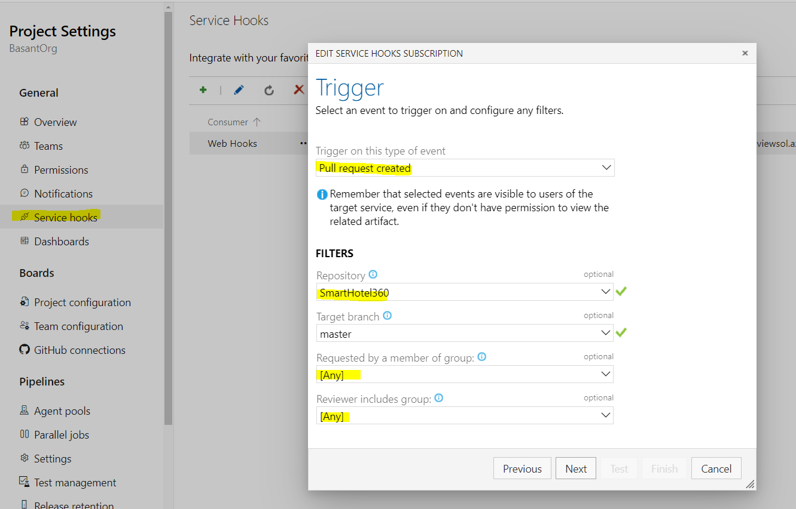
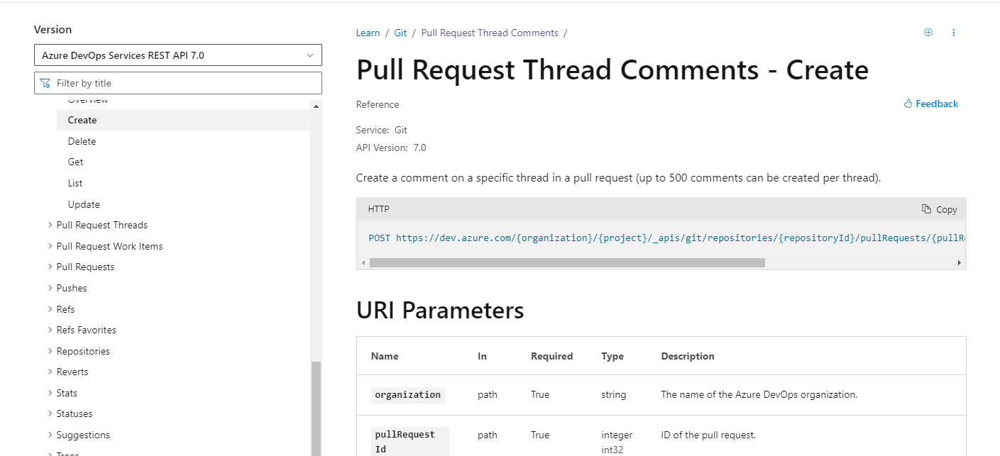
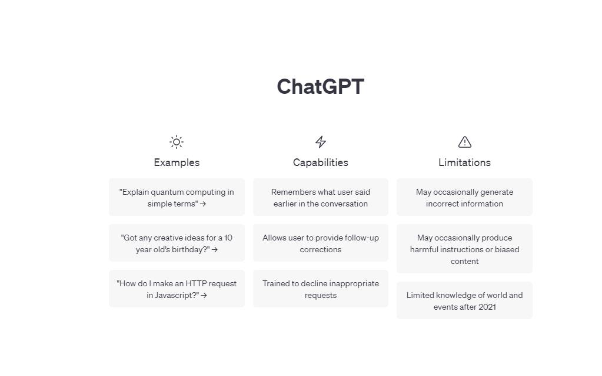

# Azure Logic App to Review Pull using chat GTP

## Introduction

1. First, you need to create a Logic App in Azure. You can do this by going to the Azure portal and searching for "Logic App" in the search bar. Then, click on "Create" and follow the prompts to set up your Logic App.Once you have your Logic App set up, you need to add a trigger. In this case, we want the Logic App to be triggered when a new pull request is created in ADO. To do this, add the "Azure DevOps - When a pull request is created" trigger to your Logic App.

2. Next, you need to add an action to your Logic App that will create a code review. For this, we will use ChatGPT. Add the "HTTP - HTTP" action to your Logic App and configure it to use the ChatGPT API to generate a code review. You will need to provide the necessary inputs to the API, such as the code to be reviewed and the desired review criteria.

3. Finally, you need to add an action to your Logic App that will create the code review in ADO. To do this, add the "Azure DevOps - Create a pull request review" action to your Logic App and configure it to use the output from the ChatGPT API as the review text.

Save and test your Logic App to make sure it is working correctly. Once you are satisfied, you can publish your Logic App and it will be ready to use.

Here's a high-level overview of the Logic App workflow:

1. A new pull request is created in ADO
2. The Logic App is triggered and uses ChatGPT to generate a code review
3. The Logic App creates a new code review in ADO using the output from ChatGPT
## [Authentication](/AppRegistration/README.Md)
    1. App Registration for Logic App  

## [Create Logic App](/CreateLogicApp/README.md)
    1. Create Resoruce Group
    2. Add Logic App
        1. GTP Code Review Logic App

## [Create Web hook in Azure Devops](/Webhooks/README.md)
    1. Navigate to your Registory

## [DevOps Api](DevOpsApi/README.md)
    1. Get the Pull Information 
    2. Create comments to the pull request

## Configure Chat GPT to generate a code review comments
    1. Create Account 
    2. Create Token
    3. ChatGPT API to generate a code review

