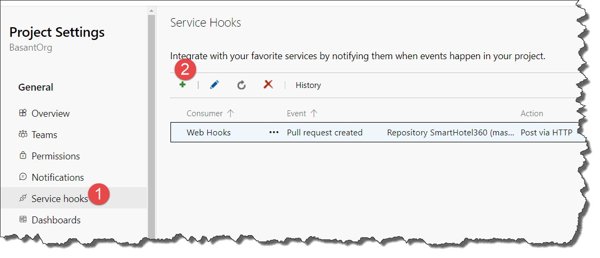
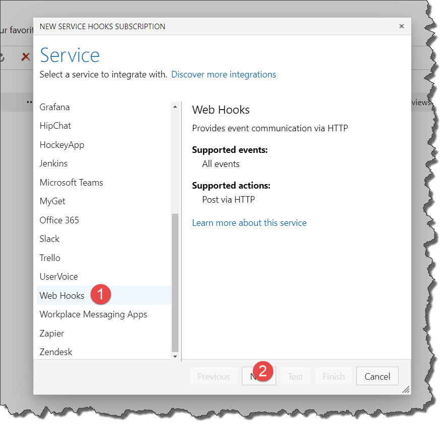
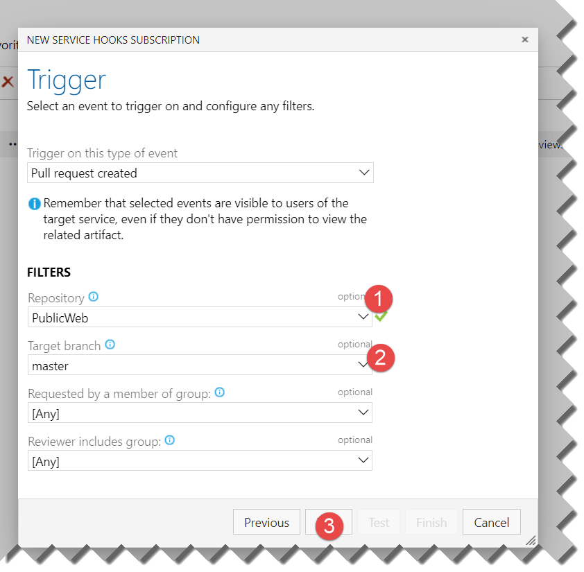
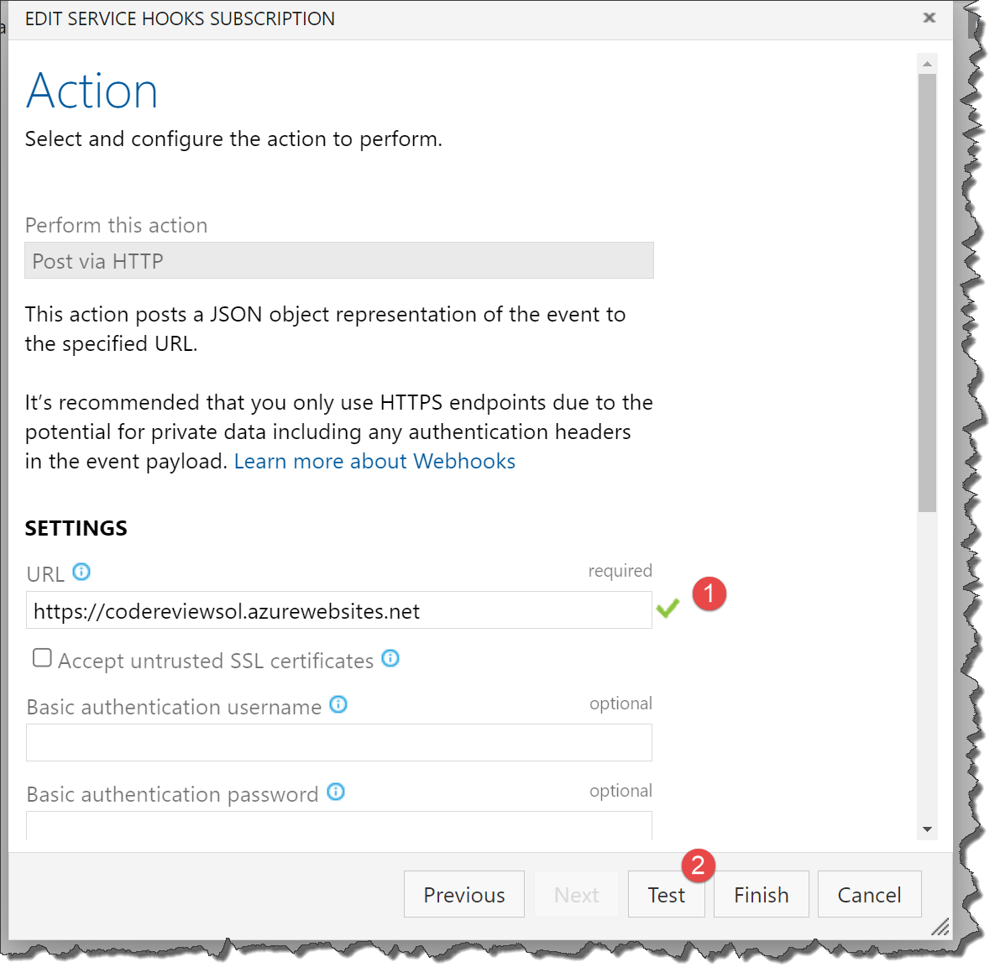
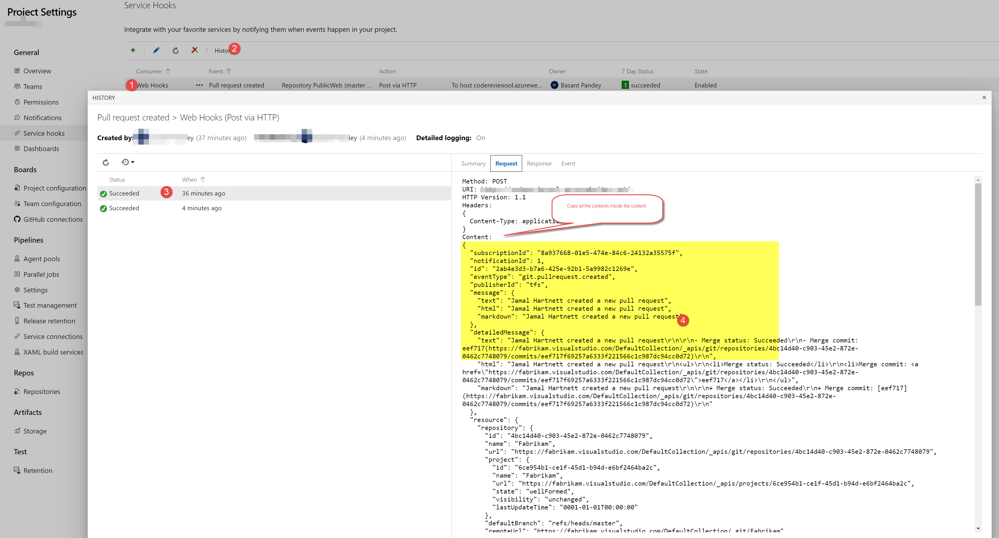
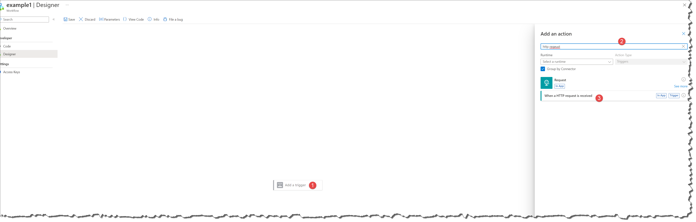
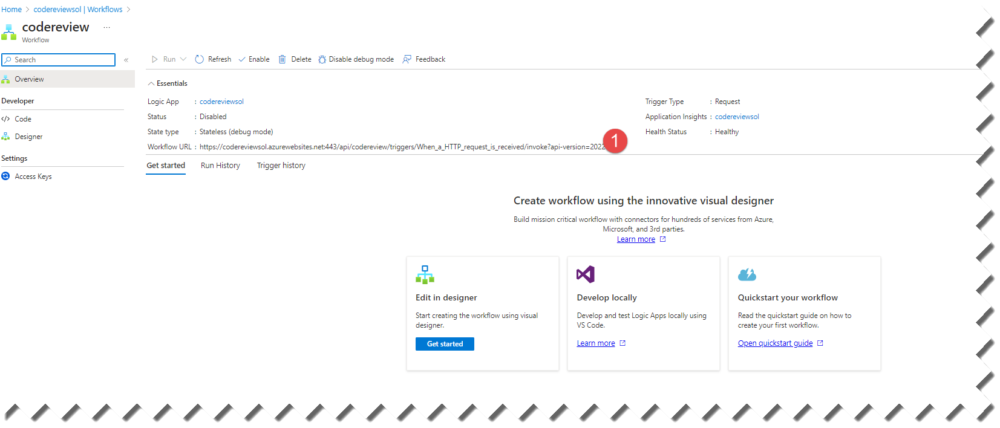
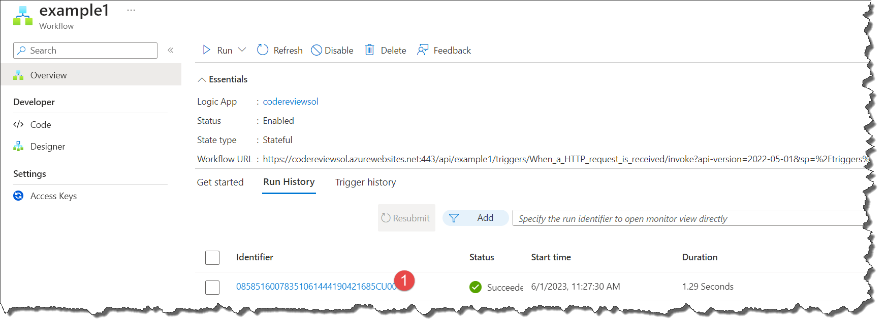
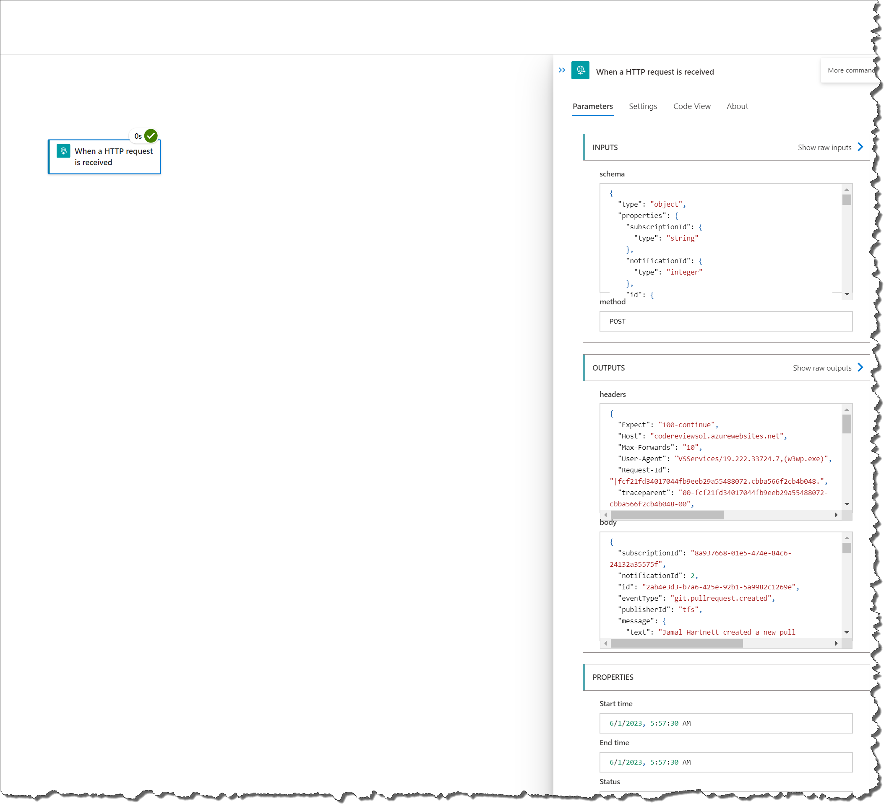

# Setup webhooks
- Login to devops portal https://dev.azure.com/
- Navigate to your Azure DevOps project.
- Go to the "Project Settings" by clicking on the gear  icon in the bottom-left corner.
- In the Project Settings page, select "Service hooks" under the "Pipelines" section.

- Click on the "Create subscription" button to create a - new service hook subscription.

- Choose the event that will trigger the service hook. - You can select from a wide range of events such as - code pushed, work item created/updated, build - completed, release deployment completed, etc. Select - the appropriate event for your use case.

- Select the service to send the event to. Azure DevOps - supports various services such as Azure Functions, - Azure Logic Apps, Webhooks, etc. Choose the service - that you want to integrate with.

- Configure the settings for the selected service. The configuration options may vary depending on the - service you choose. Typically, you'll need to provide details like the endpoint URL, authentication, payload format, etc.

- Test the service hook by sending a test payload or use - a recent event to validate the integration. 
- Save the service hook subscription.

# Test the webhooks
- Test the above functionality inside the logic app.
    1. Navigate to the service hooks list.
    1. Select the webhook.
    1. Click to the history.
    1. Select the running workflow. 
    1. Copy the Request inside the content 

- Create new logic app workflow 
    1. Add example workflow.
    1. Add Trigger "When a http request is received".
    
- Setting "When a http request is received" action
    1. Click to the action. 
    1. The left side property window opens, click "User simple payload to generate schema"
    1. Use the copy the request content and paste in the sample json payload. 
    1. click done. 
    1. Save the workflow. 
     
- Once you save the workflow in the workflow home page you able to see the workflow Url.

- modify the actual webhook url. Copy above workflow url and update the url action section. 
    1. update Url point number 1. 
    2. Click test button again. 

- Navigate to the logic app workflow and see the history. 
    1. Click to the workflow and select the example 1 workflow.
    2. Click to the history tab.
     
    3. Click the link you will able to see the last run see the request and response body. 
    